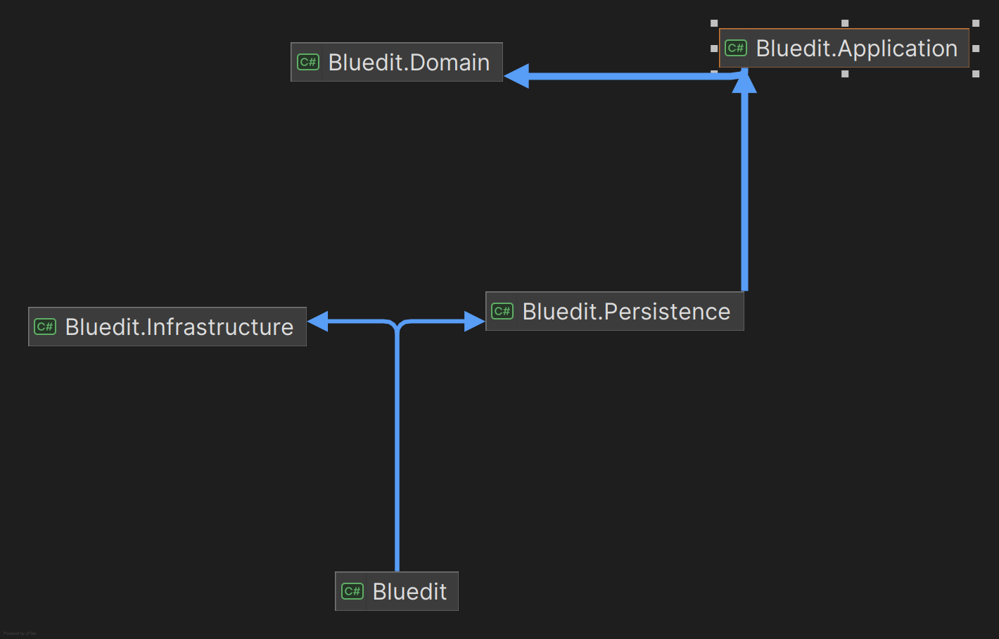

# Bluedit

Bluedit is a small backend service for a social media platform similar to Reddit, built with ASP.NET Core.


## Getting Started

To get started with Bluedit, follow these steps:

1. Clone the repository:
    ```sh
    git clone https://github.com/yourusername/bluedit.git
    cd bluedit
    ```

2. Install the required dependencies:
    ```sh
    dotnet restore
    ```

3. Set up the connection strings in `appsettings.json`:
    ```json
   {  
        "DbContextConnectionString": "Server=localhost,1433;Database=BlueditDb;User Id=sa;Password=<YourStrong@Passw0rd>;Integrated Security=false;Encrypt=False",    
        "AzureBlobContainerLink": "AzureBlobContainerLink",
        "ContainerName": "blueditcontainer",
        "AzureStorageConnectionString": "AzureConectionString"
   }
    ```

4. Build the project:
    ```sh
    dotnet build
    ```

5. Run the project:
    ```sh
    dotnet run --project Bluedit
    ```

## Project Structure





## Functionality

### User Management

- **Register User**: Allows new users to register an account by providing a username, email, and password. The system validates the input and creates a new user record in the database.
- **User Info**: Retrieves information about the authenticated user, such as username, email, and registration date. This endpoint requires authentication.
- **Update User**: Allows users to update their profile information, including name, email, and password. The system validates the input and updates the user record in the database.

### Topics

- **Create Topic**: Allows administrators to create new topics by providing a name and description. The system validates the input and creates a new topic record in the database.
- **Get Topics**: Retrieves a list of all topics available on the platform. Each topic includes its name and description.
- **Get Topic**: Retrieves details of a specific topic by its name, including the description and the number of posts associated with it.
- **Update Topic**: Allows administrators to update the description of an existing topic. The system validates the input and updates the topic record in the database.
- **Delete Topic**: Allows administrators to delete a topic and all its associated posts. The system removes the topic record and all related post records from the database.

### Posts

- **Create Post**: Allows authenticated users to create new posts within a specific topic by providing a title and content. The system validates the input and creates a new post record in the database.
- **Get Posts**: Retrieves a list of posts within a specific topic, including the post title, content, author, and creation date.
- **Get Post Info**: Retrieves detailed information about a specific post, including the content, author, creation date, and number of replies.
- **Update Post**: Allows users to update their own posts by modifying the title and content. The system validates the input and updates the post record in the database.
- **Delete Post**: Allows users to delete their own posts. The system removes the post record and all related reply records from the database.

### Replies

- **Create Reply**: Allows users to reply to posts or other replies by providing content. The system validates the input and creates a new reply record in the database.
- **Get Replies**: Retrieves a list of replies for a specific post, including the reply content, author, and creation date.
- **Update Reply**: Allows users to update their own replies by modifying the content. The system validates the input and updates the reply record in the database.
- **Delete Reply**: Allows users to delete their own replies. The system removes the reply record from the database.

### Likes

- **Like Post**: Allows users to like a post, increasing its like count. The system creates a new like record in the database.
- **Unlike Post**: Allows users to remove their like from a post, decreasing its like count. The system removes the like record from the database.
- **Like Reply**: Allows users to like a reply, increasing its like count. The system creates a new like record in the database.
- **Unlike Reply**: Allows users to remove their like from a reply, decreasing its like count. The system removes the like record from the database.
- **Get Likes**: Retrieves the list of users who have liked a specific post or reply, including the usernames of the users who liked it.

## Db Structure

The entities in this project have several relationships, primarily defined through foreign keys and navigation properties. Here are the key relationships:


## License

This project is licensed under the MIT License.